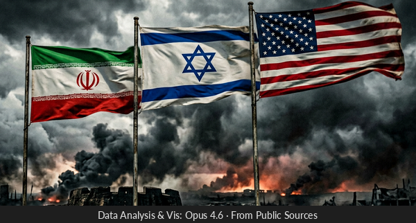
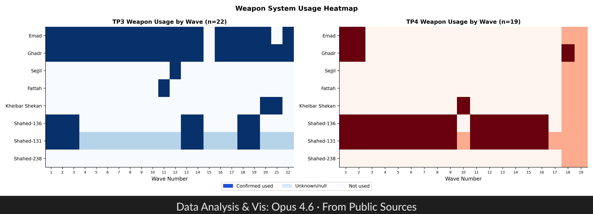
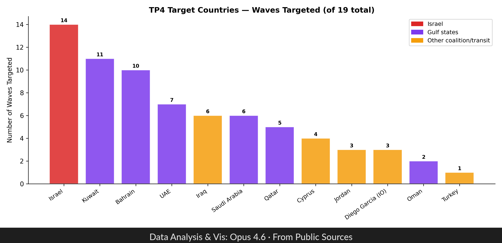
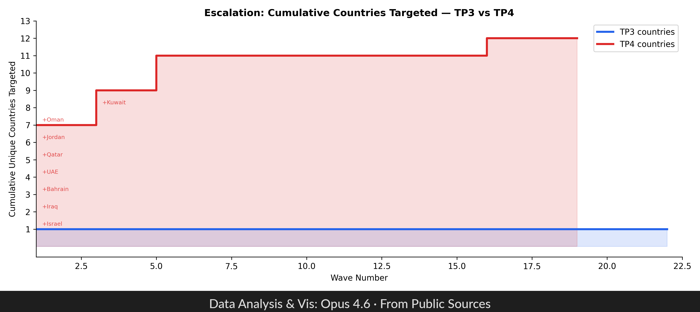

# Iran-Israel War — OSINT Dataset

Open-source intelligence dataset tracking Iranian missile and drone attack waves against Israel and US/coalition targets across four operations in the "True Promise" series — Iran's first-ever direct military strikes on Israeli territory.

> **Data Quality Disclaimer**: This dataset was assembled using a combination of AI-assisted research (multi-model LLM queries), news reporting, and publicly available OSINT sources. **It may contain inaccuracies, gaps, or errors.** Timestamps are approximate for many events. Munitions counts and casualty figures vary across sources and should be treated as estimates. Iranian state media claims (PressTV, Tasnim, IRGC statements) are preserved but often unverifiable. This data is provided for research and educational purposes only — always cross-reference against primary sources before drawing conclusions.

**[Interactive Map & Dashboard](https://iranisrael.danielrosehill.com)** | **[TP3 vs TP4 Analysis Report (PDF)](report/report.pdf)** | **[Kaggle Dataset](https://www.kaggle.com/datasets/danielrosehill/iran-israel-war-2026)** | **[Hugging Face Dataset](https://huggingface.co/datasets/danielrosehill/Iran-Israel-War-2026)**

> This repository is the upstream data source for the OSINT analysis site at [iranisrael.danielrosehill.com](https://iranisrael.danielrosehill.com). JSON data from this repo is synced into the site's pipeline automatically.

---

## Table of Contents

- [Operations Overview](#operations-overview)
- [SQLite Database](#sqlite-database)
- [Operation True Promise 1 (Apr 2024)](#operation-true-promise-1-apr-2024)
- [Operation True Promise 2 (Oct 2024)](#operation-true-promise-2-oct-2024)
- [Operation True Promise 3 (Jun 2025)](#operation-true-promise-3--twelve-day-war-jun-2025)
- [Operation True Promise 4 (Feb–Mar 2026)](#operation-true-promise-4-feb-2026)
- [Charts & Analysis](#charts--analysis)
- [Reference Data](#reference-data)
- [Repository Structure](#repository-structure)
- [Data Conventions](#data-conventions)
- [Potential Use Cases](#potential-use-cases)
- [Methodology](#methodology)
- [License](#license)

---

## Operations Overview

| Operation | Date | Waves | Munitions | Targets | Trigger |
|-----------|------|------:|----------:|---------|---------|
| **[True Promise 1](#operation-true-promise-1-apr-2024)** | Apr 13–14, 2024 | 2 | ~320 | Israel (airbases) | Israeli strike on Iranian consulate in Damascus |
| **[True Promise 2](#operation-true-promise-2-oct-2024)** | Oct 1, 2024 | 2 | ~200 | Israel (airbases, intelligence HQ) | Assassination of Hassan Nasrallah; Israeli invasion of Lebanon |
| **[True Promise 3](#operation-true-promise-3--twelve-day-war-jun-2025)** | Jun 13–24, 2025 | 22 | ~1,600–1,800 | Israel (cities, bases, infrastructure) | Israeli preemptive strikes on Iranian nuclear facilities (Op. Rising Lion) |
| **[True Promise 4](#operation-true-promise-4-feb-2026)** | Feb 28–ongoing, 2026 | 19+ | TBD | Israel, US/coalition bases across Gulf & Med | Continued escalation; expanded to US/coalition targets |

TP1 and TP2 were the **first direct Iranian military attacks on Israeli territory** in the history of the Iran-Israel conflict. Prior confrontations had been conducted exclusively through proxies (Hezbollah, Hamas, Islamic Jihad, Houthis). TP3 and TP4 represented a dramatic escalation in scale, duration, and geographic scope.

---

## SQLite Database

All wave data, reference tables, and junction tables are available as a single queryable SQLite database:

**[`data/iran_israel_war.db`](data/iran_israel_war.db)** (168 KB)

Rebuild from JSON sources: `python3 build_db.py`

### Tables

| Table | Rows | Description |
|-------|-----:|-------------|
| `operations` | 4 | Metadata per operation (TP1–TP4) with aggregate stats |
| `waves` | 45 | One row per wave — 76 columns (flattened timing, weapons, targets, interception, impact, escalation) |
| `wave_landing_countries` | 102 | Countries where munitions landed per wave |
| `wave_interception_systems` | 116 | Defense systems used per wave |
| `wave_us_bases_targeted` | 18 | US/coalition bases targeted per wave |
| `wave_sources` | 27 | Source URLs per wave |
| `iranian_weapons` | 11 | Iranian missile + drone specs |
| `defense_systems` | 8 | Coalition BMD / air defense specs |
| `armed_forces` | 20 | Armed forces and non-state groups (incl. Hezbollah, Houthis, Iraqi militias) |
| `us_bases` | 9 | US/coalition base locations |
| `us_naval_vessels` | 2 | Tracked naval vessels |

### Example Queries

```sql
-- Munitions and casualties per operation
SELECT operation, COUNT(*) as waves,
       SUM(estimated_munitions_count) as known_munitions,
       SUM(fatalities) as killed, SUM(injuries) as wounded
FROM waves GROUP BY operation;

-- Which weapon systems were used in each operation?
SELECT operation, COUNT(*) as waves_used FROM waves
WHERE emad_used = 1 GROUP BY operation;

-- Countries targeted across TP4
SELECT country_code, COUNT(*) as waves_hit
FROM wave_landing_countries WHERE operation = 'tp4'
GROUP BY country_code ORDER BY waves_hit DESC;

-- Defense systems used per operation
SELECT w.operation, s.system_name, COUNT(*) as times_used
FROM wave_interception_systems s
JOIN waves w ON s.operation = w.operation AND s.wave_number = w.wave_number
GROUP BY w.operation, s.system_name ORDER BY w.operation, times_used DESC;
```

Compatible with Python `sqlite3`, DuckDB, [Datasette](https://datasette.io/), DB Browser for SQLite, and any SQL client.

---

## Operation True Promise 1 (Apr 2024)

**Dataset**: [`data/tp1-2024/waves.json`](data/tp1-2024/waves.json)

Iran's first-ever direct attack on Israel. A coordinated multi-front operation using drones, cruise missiles, and ballistic missiles, launched in collaboration with Hezbollah, Iraqi militias, and the Houthis. Israel and a US-led coalition (codenamed Operation Iron Shield) intercepted ~99% of incoming munitions.

- **Date**: April 13–14, 2024
- **Total munitions**: ~320 (170 drones, 30 cruise missiles, 120 ballistic missiles)
- **Casualties**: 0 killed, 32 wounded (1 serious)
- **Interception rate**: ~99% (Israeli/coalition claim)
- **Historical significance**: First direct Iranian attack on Israel; largest drone attack by any country at the time

### TP1 Wave Summary

| Wave | Time (UTC) | Weapons | Targets | Key Detail |
|-----:|-----------|---------|---------|------------|
| 1 | Apr 13 ~19:00 | 170 Shahed-136 drones, 30 Paveh cruise missiles | Nevatim AB, Negev, Golan Heights | Drone saturation wave to exhaust air defenses |
| 2 | Apr 13 ~23:00 | 120 BMs (Emad, Ghadr, Kheibar Shekan, Shahab-3B) | Nevatim AB, Negev | Minor damage to Nevatim; SM-3 first combat use |

---

## Operation True Promise 2 (Oct 2024)

**Dataset**: [`data/tp2-2024/waves.json`](data/tp2-2024/waves.json)

A ballistic-missile-only strike — no drones or cruise missiles. Iran abandoned the multi-wave saturation approach of TP1 in favor of rapid ballistic salvos, reducing warning time. More missiles penetrated Israeli defenses than in TP1. First confirmed combat use of Iran's Fattah-1 hypersonic missile.

- **Date**: October 1, 2024
- **Total munitions**: ~200 ballistic missiles
- **Casualties**: 2 killed, 8 wounded
- **Interception rate**: ~99% (Israel claim) / ~90% success (Iran claim)
- **Notable**: First combat use of Fattah-1 hypersonic missile; 20–32 impacts confirmed at Nevatim AB by satellite imagery

### TP2 Wave Summary

| Wave | Time (UTC) | Weapons | Targets | Key Detail |
|-----:|-----------|---------|---------|------------|
| 1 | Oct 1 ~16:30 | Emad, Ghadr-H/F, Kheibar Shekan BMs | Nevatim AB, Tel Nof AB, Hatzerim AB | 20–32 missiles hit Nevatim per satellite analysis |
| 2 | Oct 1 ~16:45 | Fattah-1, Emad, Kheibar Shekan BMs | Mossad/Unit 8200 HQ (Glilot), Nevatim, Tel Nof | Fattah-1 hypersonic first combat use; impacts ~500m from Mossad HQ |

---

## Operation True Promise 3 / Twelve-Day War (Jun 2025)

**Dataset**: [`data/tp3-2025/waves.json`](data/tp3-2025/waves.json)

A massive 12-day sustained bombardment — the largest Iranian attack in the series. Triggered by Israel's preemptive Operation Rising Lion strikes on Iranian nuclear facilities. 22 waves over 12 days with an estimated 1,600–1,800 munitions. Significant civilian casualties and infrastructure damage across Israel.

- **Date**: June 13–24, 2025
- **Total waves**: 22
- **Total munitions**: ~1,600–1,800
- **Casualties**: 33 killed, 3,238 wounded
- **Interception rate**: ~86% (Israeli claim)
- **Countries affected**: Israel, Jordan (debris), Syria (debris), Palestine (West Bank — Houthi missile), Iraq (US consulate Erbil targeted)

### TP3 Wave Summary

| Wave | Date | Weapons | Key Targets | Key Detail |
|-----:|------|---------|-------------|------------|
| 1 | Jun 13 | Emad, Ghadr BMs + Shahed drones | Tel Aviv, Nevatim AB | Opening salvo |
| 2 | Jun 14 | Sejjil, Kheibar Shekan BMs | Haifa, Northern Israel | Solid-fuel missiles introduced |
| 3 | Jun 14 | Mixed BMs + drones | Tel Aviv, Negev | |
| 4 | Jun 15 | Emad, Ghadr, Shahed-136 | Bat Yam, Tel Aviv metro | **9 killed, 200+ injured** — residential building hit |
| 5 | Jun 15 | BMs + cruise missiles | Haifa, Bazan Oil Refinery | **3 killed** — refinery shut down |
| 6 | Jun 16 | Shahed-238 jet drones + BMs | Multiple cities | Shahed-238 first use in conflict |
| 7 | Jun 16 | Fattah-1, Kheibar Shekan | Petah Tikva, Bnei Brak | **5 killed** — 20-story building hit |
| 8 | Jun 17 | Mixed salvo | Rishon LeZion, Ramat Gan | **3 killed** |
| 9 | Jun 17 | BMs + drones | IDF bases, Negev | |
| 10 | Jun 18 | Emad, Sejjil | Weizmann Institute, Rehovot | **$500M–$1B damage** — 45 labs hit |
| 11 | Jun 18 | Mixed | Haifa Power Plant | Power plant struck, fire |
| 12 | Jun 19 | BMs | Glilot intel base, Kirya IDF HQ | Confirmed hits by satellite |
| 13 | Jun 19 | Drones + BMs | Multiple | |
| 14 | Jun 20 | BMs | Tel Nof AB | Confirmed hit by satellite |
| 15 | Jun 20 | Mixed | Eshkol Power Station, Ashdod | Power outages |
| 16 | Jun 21 | BMs + drones | Multiple cities | |
| 17 | Jun 21 | Mixed | Tamra | **4 Arab Israelis killed** |
| 18 | Jun 22 | BMs | Soroka Medical Center, Beersheba | Hospital struck, 80 injured |
| 19 | Jun 22 | Drones | Multiple | |
| 20 | Jun 23 | BMs | Herzliya | Wastewater treatment struck |
| 21 | Jun 23 | Mixed | Multiple | |
| 22 | Jun 24 | Final salvo — BMs + drones | Beersheba | **4 killed, 20 injured** — final wave |

> **Note**: TP3 wave-level detail is partial. Many waves have incomplete munitions counts and approximate timing. The table above is a simplified summary — see the full JSON for all available fields.

---

## Operation True Promise 4 (Feb 2026)

**Dataset**: [`data/tp4-2026/waves.json`](data/tp4-2026/waves.json)

The most geographically expansive operation. For the first time, Iran directly targeted US/coalition military bases across the Gulf and Mediterranean alongside Israeli targets. 19+ waves documented across 12 countries.

- **Date**: February 28 – ongoing, 2026
- **Total waves**: 19+
- **Countries targeted**: Israel, Kuwait, Bahrain, UAE, Qatar, Saudi Arabia, Iraq, Oman, Cyprus, Jordan, Turkey, Diego Garcia
- **75+ data fields** per wave covering timing, weapons, targets, interception, and escalation
- Reference data for US/coalition bases and naval vessels in [`data/tp4-2026/reference/`](data/tp4-2026/reference/)

### TP4 Key Features

- Expanded targeting to **US Fifth Fleet HQ (Bahrain)**, **Al Udeid AB (Qatar)**, **Camp Arifjan (Kuwait)**, and other US/coalition installations
- Continued use of Fattah-1/2 hypersonic missiles
- Houthi coordination for Red Sea/Gulf of Aden axis
- Naval vessel targeting (USN carriers, destroyers)

---

## Charts & Analysis

Generated charts are stored in **date-stamped subfolders** using `DDMM` format (e.g. `report/0503/` for March 5). This ensures each generation run is timestamped and prior outputs are preserved. Run `python3 gen_charts.py` to regenerate into today's subfolder.

### Weapon System Heatmap (TP3 vs TP4)



### Target Geography (TP4)



### Escalation Staircase — Cumulative Countries Targeted



See [`analysis/charts/`](analysis/charts/) for additional standalone visualizations and [`report/report.pdf`](report/report.pdf) for the full 15-page TP3 vs TP4 comparative analysis.

---

## Reference Data

| File | Description |
|------|-------------|
| [`data/reference/iranian_weapons.json`](data/reference/iranian_weapons.json) | Iranian missile + drone specs (Emad, Ghadr, Sejjil, Kheibar Shekan, Fattah-1/2, Shahed-131/136/238, Mohajer-6, Paveh) |
| [`data/reference/defense_systems.json`](data/reference/defense_systems.json) | Coalition BMD / air defense specs (Arrow-2/3, David's Sling, Iron Dome, THAAD, Patriot, Aegis SM-2/3) |
| [`data/reference/armed_forces.json`](data/reference/armed_forces.json) | Armed forces and non-state groups on both sides |
| [`data/reference/us_bases.json`](data/reference/us_bases.json) | US/coalition military bases with coordinates |
| [`data/reference/us_naval_vessels.json`](data/reference/us_naval_vessels.json) | Tracked naval vessels |

### Data Fields

| Category | Fields |
|----------|--------|
| **Timing** | UTC timestamps, local times (Israel/Iran), solar phase, conflict day, tempo between waves |
| **Weapons** | Payload descriptions, missile/drone types (Emad, Ghadr, Sejjil, Fattah, Shahed-136/238, etc.), fuel and warhead categories |
| **Targets** | Israeli locations, US/coalition bases, naval vessels, country-level targeting |
| **Interception** | Systems used (Iron Dome, Arrow, David's Sling, THAAD, Aegis), interception rates, exo/endo phase |
| **Impact** | Casualties, infrastructure damage, military vs. civilian impact |
| **Escalation** | Escalation flags, proxy involvement, cumulative munitions tracking |

---

## Repository Structure

```
data/
  iran_israel_war.db         # SQLite database (all data combined)
  tp1-2024/
    waves.json               # TP1 wave data (2 waves, Apr 2024)
  tp2-2024/
    waves.json               # TP2 wave data (2 waves, Oct 2024)
  tp3-2025/
    waves.json               # TP3 wave data (22 waves, Jun 2025)
  tp4-2026/
    waves.csv                # Original flat CSV (75+ columns)
    waves.json               # Canonical nested JSON (19 waves)
    waves.geojson            # GeoJSON export
    waves.kml                # KML export
    reference/
      israeli_targets.json   # Israeli target sites with coordinates
      launch_zones.json      # Iranian launch zone centroids
  reference/                 # Shared reference data
    iranian_weapons.json     # Iranian missile + drone specs
    defense_systems.json     # Coalition BMD / air defense system specs
    armed_forces.json        # Armed groups/forces in conflict
    us_bases.json            # US/coalition bases with coordinates
    us_naval_vessels.json    # Tracked naval vessels
  schema/
    wave.schema.json         # JSON Schema for wave data validation
build_db.py                  # Rebuild SQLite from JSON sources
report/
  report.pdf                 # TP3 vs TP4 comparative analysis (15 pages)
  report.typ                 # Typst source
  report_*.png               # Report charts (legacy, root level)
  DDMM/                      # Date-stamped chart outputs (e.g. 0503/ for Mar 5)
    report_*.png
analysis/
  charts/                    # Standalone visualizations
    01_inter_wave_timing.png
    02_tempo_acceleration.png
    ...
prompts/
  waves.md                   # Schema documentation / LLM extraction prompt
docs/
  data-dictionary.md         # Full field reference
```

---

## Potential Use Cases

- **Pattern analysis** — temporal patterns in attack waves, escalation dynamics
- **Geovisualization** — mapping launch sites, targets, and interception zones
- **Weapons tracking** — categorizing and tracking Iranian missile/drone inventory usage
- **Interception analysis** — comparing defense system performance across waves and operations
- **Cross-operation comparison** — TP1 → TP2 → TP3 → TP4 tactical evolution
- **Escalation modeling** — how Iranian strike doctrine evolved from limited retaliation to sustained bombardment to multi-theater operations

## Data Conventions

- **Timestamps**: ISO 8601 with timezone offsets
- **Coordinates**: Decimal degrees
- **Booleans**: Native JSON `true`/`false`
- **Missing values**: `null`
- **Arrays**: Native JSON arrays for country codes, interception systems, sources
- **Country codes**: ISO 3166-1 alpha-2

Wave data is validated against [`data/schema/wave.schema.json`](data/schema/wave.schema.json). See [`docs/data-dictionary.md`](docs/data-dictionary.md) for the full field reference.

## Methodology

Data is gathered from publicly available sources including official military announcements, verified news reporting, Wikipedia timelines, satellite imagery analysis, and defense research publications. AI tools (multi-model LLM queries with source grounding) are used to accelerate data collection and structuring. Information is cross-checked across multiple sources wherever possible. Iranian nomenclature (operation names, wave codenames) is preserved alongside English translations.

This is an independent open-source research project. All data should be treated as provisional and subject to revision as new information becomes available.

## License

This dataset is provided for research and educational purposes.

## Author

[Daniel Rosehill](https://github.com/danielrosehill)
